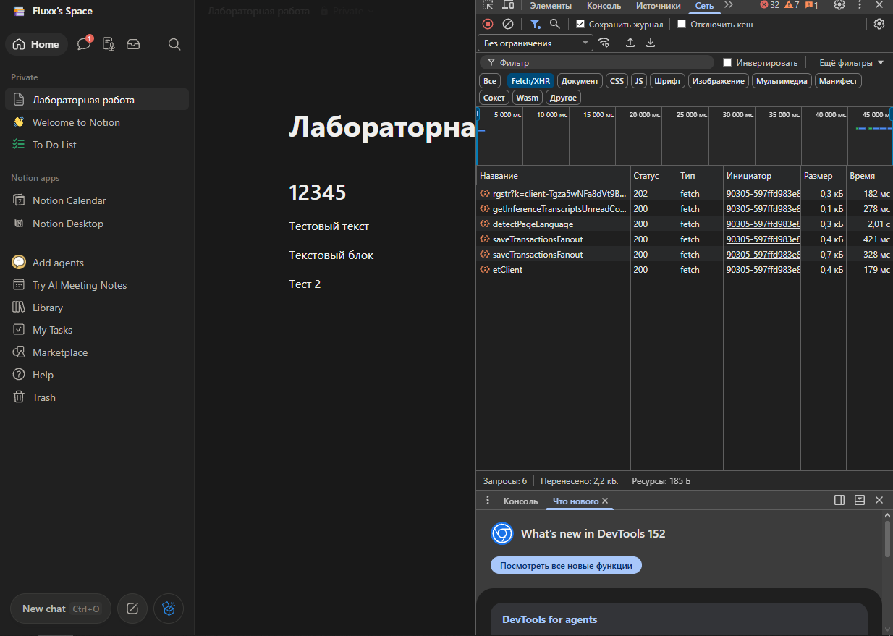
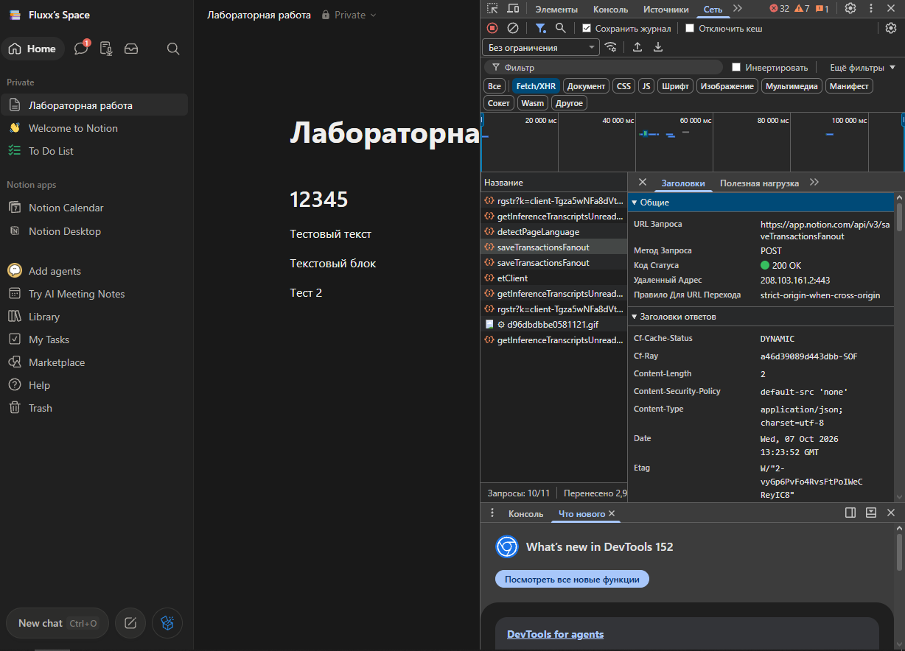
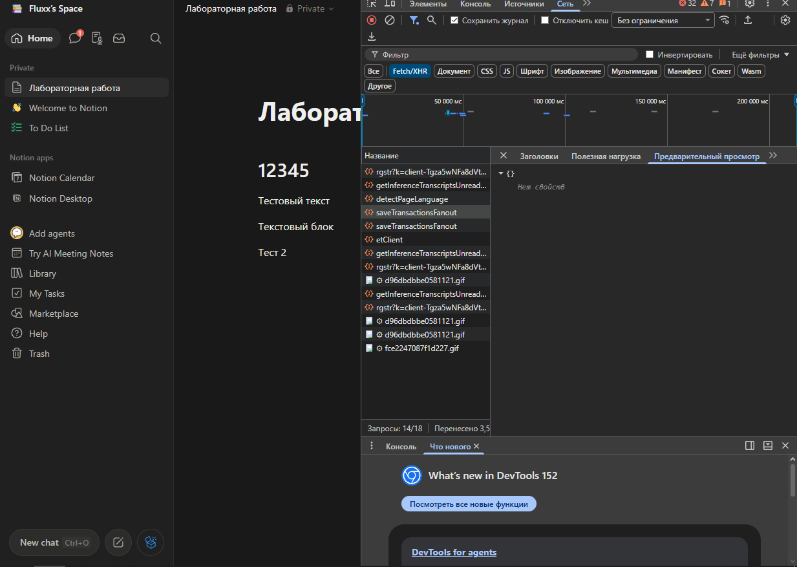
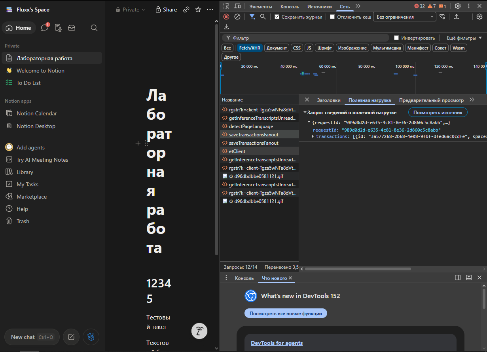
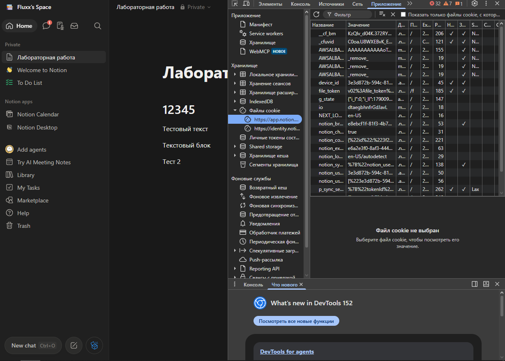
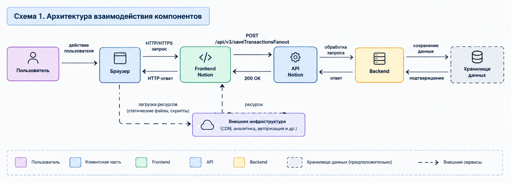
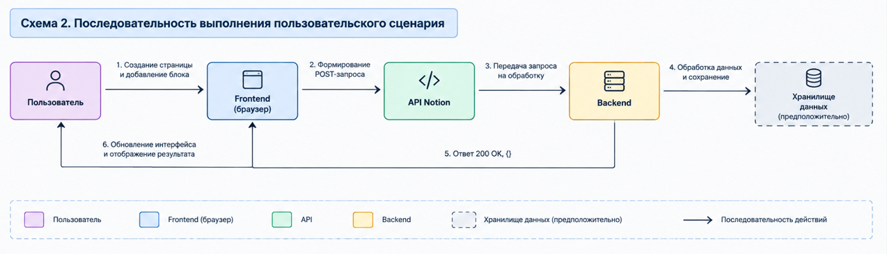

# Лабораторная работа №2
Анализ веб-приложения и клиент-серверного взаимодействия
# 1. Исследуемая информационная система

В качестве исследуемой информационной системы используется веб-сервис Notion.

Notion представляет собой цифровой SaaS-сервис для создания и редактирования страниц, заметок и структурирования информации. Пользователь может создавать страницы, добавлять текстовые блоки, изменять их содержимое и организовывать информацию внутри рабочего пространства.

В первой лабораторной работе была исследована информационная система Notion, а также выбран пользовательский сценарий:

создание страницы и добавление блока.

Во второй лабораторной работе исследуется сетевое взаимодействие между браузером и серверной частью Notion при выполнении данного сценария.

Основное внимание уделяется HTTP-запросам, HTTP-ответам, API, передаваемым данным и cookies.

Для исследования использовались браузер Google Chrome и встроенные инструменты разработчика DevTools.

# 1.1. Пользовательский сценарий

В рамках лабораторной работы рассматривается следующий сценарий:

Пользователь открывает рабочее пространство Notion.
Пользователь открывает страницу.
Пользователь вводит или изменяет название страницы.
Пользователь добавляет текстовый или заголовочный блок.
Пользователь изменяет содержимое блока.
Клиентская часть Notion обрабатывает изменение.
Браузер отправляет HTTP-запрос на сервер.
Сервер обрабатывает полученные данные.
Сервер возвращает HTTP-ответ.
Клиентская часть продолжает отображать изменённое содержимое страницы.

В качестве основного сетевого запроса в работе рассматривается:

POST /api/v3/saveTransactionsFanout

Данный запрос был обнаружен в DevTools после изменения содержимого страницы.

# 2. Анализ HTTP-запросов

Для исследования HTTP-взаимодействия был использован раздел Network в DevTools.

Перед выполнением действия пользователя список сетевых запросов был очищен, после чего в странице Notion было изменено содержимое.

В результате в Network были обнаружены различные запросы типа Fetch.

Рисунок 1 — Список сетевых запросов Notion в DevTools

На рисунке 1 можно увидеть несколько запросов, которые выполняются клиентской частью приложения.

В частности, были обнаружены:

detectPageLanguage;
saveTransactionsFanout;
getAssetsJsonV2;
etClient;
несколько служебных запросов.

Большинство исследованных запросов имеют статус 200, что означает успешное получение ответа от сервера.

# 2.1. HTTP-методы

В ходе исследования основное внимание было уделено запросу saveTransactionsFanout.

Для него используется HTTP-метод:

POST

Метод POST применяется для передачи данных от клиента серверу.

В рассматриваемом случае клиентская часть передаёт серверу информацию об изменениях страницы.

Также в Network были обнаружены другие Fetch-запросы, выполняемые клиентской частью приложения.

На основании наблюдений можно сделать вывод, что Notion активно использует сетевые API-запросы для взаимодействия браузера с серверной частью.

# 2.2. Основной HTTP-запрос

Основным исследуемым запросом является:

POST https://app.notion.com/api/v3/saveTransactionsFanout

Метод запроса:

POST

Статус ответа:

200 OK

Тип запроса в DevTools:

Fetch

Назначение запроса — передача изменений страницы от клиентской части приложения серверу.

При выполнении пользовательского действия клиентская часть формирует данные об изменениях и передаёт их серверной части через API.

# 2.3. Заголовки HTTP-запроса и ответа

Для более подробного анализа был открыт запрос saveTransactionsFanout и рассмотрен раздел Headers.

Рисунок 2 — Заголовки и основные параметры запроса saveTransactionsFanout

В исследованном запросе были непосредственно наблюдаемы следующие параметры:

URL запроса — https://app.notion.com/api/v3/saveTransactionsFanout;
метод — POST;
статус — 200 OK;
протокол — HTTPS;
тип содержимого ответа — application/json.

Таким образом, взаимодействие между браузером и API происходит по защищённому протоколу HTTPS.

В ответе также присутствует заголовок Content-Type, указывающий на использование формата JSON.

В DevTools также наблюдались HTTP-заголовки, связанные с инфраструктурой обработки запроса. Однако по данным браузера нельзя определить полную внутреннюю архитектуру серверной части Notion.

# 3. Анализ HTTP-ответов

После отправки HTTP-запроса сервер возвращает ответ клиентской части.

Для основного запроса saveTransactionsFanout был получен статус:

200 OK

Статус 200 OK означает, что HTTP-запрос был успешно обработан.

В данном случае сервер не возвращает клиенту большой набор данных. Ответ содержит пустой JSON-объект.

3.1. Формат ответа

В разделе предварительного просмотра ответа было обнаружено:

{}

Рисунок 3 — Ответ сервера на запрос saveTransactionsFanout

В DevTools для ответа отображается пустой объект JSON.

Это означает, что тело ответа не содержит дополнительных свойств или данных, необходимых для отображения результата пользователю.

При этом сам запрос считается успешно выполненным, поскольку сервер вернул статус:

200 OK.

Следовательно, для данного запроса основная задача заключается не в получении информации от сервера, а в передаче серверу изменений, выполненных пользователем.

# 3.2. Результат обработки запроса

Последовательность взаимодействия в данном случае можно представить следующим образом:

Пользователь изменяет содержимое страницы → клиентская часть формирует данные → выполняется POST-запрос → сервер получает изменения → сервер возвращает 200 OK и {} → клиентская часть продолжает работу со страницей.

Таким образом, HTTP-ответ подтверждает успешную обработку запроса, но не содержит подробной информации о сохранённых изменениях.

# 4. Анализ параметров и передаваемых данных

Особое внимание было уделено содержимому запроса saveTransactionsFanout.

В DevTools был открыт раздел Payload, в котором отображается тело HTTP-запроса.

Рисунок 4 — Payload запроса saveTransactionsFanout

В теле запроса были обнаружены следующие основные поля:

requestId

и

transactions

Поле requestId содержит идентификатор конкретного запроса.

Поле transactions представляет собой массив объектов, описывающих изменения, которые должны быть обработаны серверной частью.

Внутри элементов массива также наблюдались параметры, связанные с идентификатором объекта и рабочего пространства, в частности:

id

и

spaceId.

Таким образом, клиентская часть не передаёт серверу просто текстовое содержимое страницы в виде одного обычного поля. Вместо этого изменения передаются в структурированном виде как набор транзакций.

# 4.1. Назначение передаваемых данных

На основании анализа запроса можно предположить, что:

requestId используется для идентификации запроса;
transactions содержит информацию об изменениях;
id связан с идентификатором изменяемого объекта;
spaceId связан с рабочим пространством Notion.

При этом точное внутреннее назначение всех полей определить только по DevTools невозможно.

Поэтому данные выводы следует рассматривать как анализ структуры передаваемого запроса, а не как утверждение о внутренней реализации серверной части Notion.

Значения идентификаторов, cookies, токенов и других потенциально чувствительных данных в отчёт не переносятся.

# 5. Анализ cookies

Для исследования cookies был открыт раздел Application → Cookies в DevTools.

В хранилище cookies сайта Notion были обнаружены различные служебные значения.

Рисунок 5 — Cookies сайта Notion в DevTools

В ходе исследования были обнаружены, в частности, следующие cookies:

device_id;
NEXT_LOCALE;
g_state;
notion_*;
p_sync_se...;
tcm;
token_v2;
file_token.

Значения cookies в отчёт не переносятся, поскольку некоторые из них могут содержать идентификаторы сессии, токены или другие служебные данные.

# 5.1. Назначение cookies

Cookie device_id по названию может использоваться для идентификации браузера или устройства.

NEXT_LOCALE вероятно используется для хранения настроек локали или языка интерфейса.

Cookies с названием notion_* относятся к служебным данным приложения Notion. Их точное назначение зависит от конкретного cookie.

p_sync_* вероятно связан с механизмами синхронизации.

token_v2 и file_token могут содержать данные, связанные с авторизацией или доступом к ресурсам. Их значения в отчёт не переносятся.

Важно отметить, что назначение некоторых cookies невозможно достоверно определить только по их имени. Поэтому такие назначения рассматриваются как предположение.

# 5.2. Безопасность cookies

Cookies могут использоваться веб-приложением для хранения информации, необходимой для поддержания состояния пользователя и взаимодействия с сервером.

В зависимости от назначения cookie могут применяться для:

идентификации клиента;
сохранения настроек;
поддержания пользовательской сессии;
авторизации;
синхронизации данных;
работы отдельных функций приложения.

В рамках лабораторной работы значения cookies намеренно не копировались в отчёт.

# 6. Взаимодействие Frontend, API и Backend

На основании проведённого исследования можно описать взаимодействие основных компонентов веб-приложения.

Пользователь работает с интерфейсом Notion в браузере.

Интерфейс является частью клиентской части приложения. При изменении содержимого страницы клиентская часть обрабатывает действие пользователя и формирует HTTP-запрос.

Для передачи изменений используется API Notion.

Основным обнаруженным запросом является:

POST /api/v3/saveTransactionsFanout

В запросе передаются структурированные данные, содержащие requestId и transactions.

Серверная часть получает запрос и обрабатывает переданные данные.

После обработки сервер возвращает:

200 OK

и пустой JSON-объект:

{}

После получения ответа клиентская часть продолжает отображать актуальное состояние страницы.

# 6.1. Последовательность взаимодействия

Выполнение выбранного сценария можно представить следующей последовательностью:

Пользователь выполняет действие в интерфейсе Notion.
Frontend фиксирует изменение.
JavaScript-код клиентской части формирует данные изменения.
Браузер выполняет HTTP POST-запрос.
Запрос отправляется на API Notion.
API получает данные от клиента.
Серверная часть обрабатывает запрос.
Сервер возвращает HTTP-ответ 200 OK.
В теле ответа находится {}.
Клиентская часть продолжает работу и отображает страницу пользователю.
6.2. Роль API

API является промежуточным интерфейсом взаимодействия между клиентской и серверной частями приложения.

В данном исследовании наличие API подтверждается адресом:

https://app.notion.com/api/v3/saveTransactionsFanout

Клиентская часть не взаимодействует непосредственно с предполагаемым хранилищем данных. Вместо этого данные передаются серверной части через HTTP API.

Таким образом, упрощённо взаимодействие можно представить следующим образом:

Frontend → API → Backend → хранилище данных

При этом наличие самого хранилища логически предполагается, поскольку сервис должен сохранять страницы и изменения пользователей, однако непосредственно внутреннюю систему хранения данных через DevTools наблюдать невозможно.

# 7. Сопоставление с архитектурой из лабораторной работы №1

В первой лабораторной работе была построена архитектурная модель информационной системы Notion.

В ней были выделены следующие основные компоненты:

пользователь;
браузер;
интерфейс Notion;
клиентская часть;
API;
сервер приложения;
хранилище данных;
рабочее пространство;
инфраструктурные компоненты.

В ходе второй лабораторной работы некоторые связи удалось подтвердить непосредственно с помощью DevTools.

# 7.1. Подтверждённые компоненты

Наличие клиентской части подтверждается непосредственно работой интерфейса Notion в браузере.

Наличие API подтверждается обнаруженными запросами к адресам:

https://app.notion.com/api/v3/...

В частности, был обнаружен запрос:

POST /api/v3/saveTransactionsFanout

Взаимодействие браузера с серверной частью подтверждается наличием HTTP-запросов и ответов.

Использование HTTPS также было подтверждено адресом сетевого запроса.

# 7.2. Подтверждённые взаимодействия

В ходе исследования непосредственно наблюдалось следующее взаимодействие:

Браузер → API Notion

с использованием HTTP POST-запроса.

Также было установлено, что в запросе передаются структурированные данные:

requestId

и

transactions.

Ответ сервера:

200 OK

и:

{}.

Таким образом, связь между клиентской частью и API была подтверждена непосредственно средствами DevTools.

# 7.3. Предполагаемые компоненты

Внутреннюю реализацию серверной части Notion непосредственно исследовать через браузер невозможно.

Поэтому следующие компоненты остаются предположительными:

внутренние серверы приложения;
конкретная база данных;
система хранения страниц;
внутренняя обработка транзакций;
конкретные технологии Backend.

Наличие хранилища данных предполагается исходя из назначения Notion и наличия операций сохранения изменений, однако конкретная технология хранения данных в ходе лабораторной работы не определялась.

# 7.4. Обновлённая архитектура

По результатам второй лабораторной работы архитектуру из первой лабораторной работы можно уточнить следующим образом:

Пользователь → Браузер → Frontend → HTTPS POST → API Notion → Backend → Хранилище данных

После обработки запроса:

Backend → API → HTTP 200 OK → Frontend → Обновление интерфейса

При этом часть взаимодействий Backend и хранилища остаётся предположительной, поскольку непосредственно в Network они не наблюдаются.

# 8. Схема взаимодействия компонентов

На основании проведённого исследования необходимо построить отдельную схему взаимодействия компонентов веб-приложения.

Схема должна показывать последовательность выполнения выбранного пользовательского сценария.

В схеме рекомендуется использовать следующие компоненты:

Пользователь;
Браузер;
Frontend Notion;
API Notion;
Backend;
Хранилище данных.

Основная последовательность взаимодействия:

Пользователь → Frontend

Действие пользователя: изменение страницы.

Frontend → API

HTTPS POST /api/v3/saveTransactionsFanout

API → Backend

Обработка полученного запроса.

Backend → Хранилище данных

Сохранение изменений.

Backend → API

Результат обработки.

API → Frontend

HTTP 200 OK + {}

Frontend → Пользователь

Отображение актуального содержимого страницы.

# 8.1. Схема пользовательского сценария

# 9. Вывод

В ходе лабораторной работы было исследовано клиент-серверное взаимодействие веб-приложения Notion на примере сценария создания страницы и добавления содержимого.

С помощью DevTools был исследован раздел Network и обнаружены HTTP-запросы, выполняемые клиентской частью приложения.

Основным исследуемым запросом стал:

POST https://app.notion.com/api/v3/saveTransactionsFanout

Было установлено, что запрос выполняется по протоколу HTTPS, использует метод POST и получает статус 200 OK.

В Payload запроса были обнаружены поля requestId и transactions, содержащие структурированную информацию об изменениях.

Также был исследован HTTP-ответ. Сервер вернул статус 200 OK и пустой JSON-объект {}.

Кроме того, были исследованы cookies сайта Notion. Были обнаружены cookies, связанные с идентификацией устройства, локалью, служебными функциями приложения, синхронизацией и другими механизмами. Значения cookies в отчёт не переносились.

На основании результатов исследования было подтверждено взаимодействие клиентской части с API Notion. При этом внутренняя реализация Backend и хранилища данных непосредственно через DevTools не наблюдается, поэтому соответствующие компоненты рассматриваются как предположительные.

Таким образом, исследование позволило уточнить архитектуру системы, рассмотренную в лабораторной работе №1, и проследить путь пользовательского действия от интерфейса браузера через API к серверной части и обратно.
